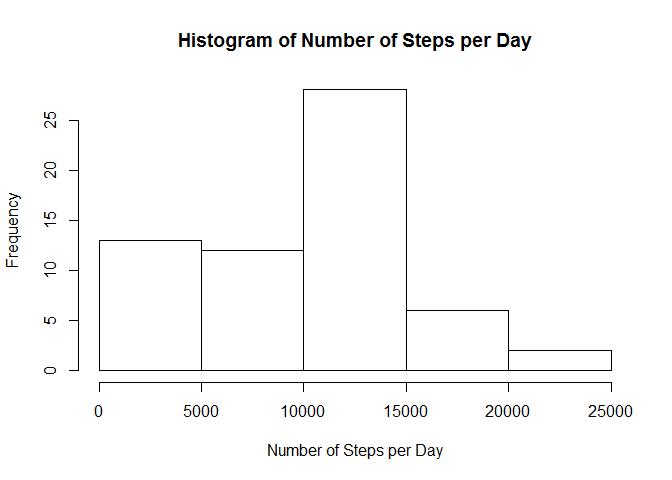
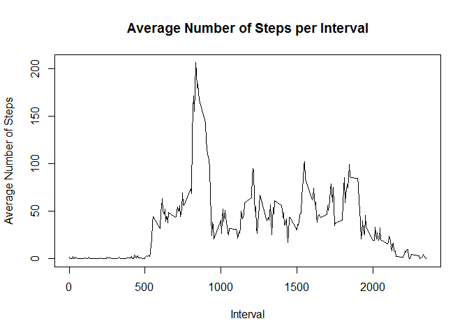
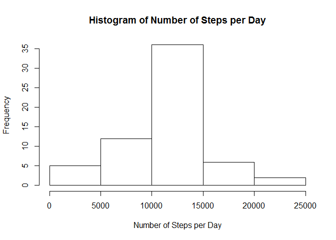

# Reproducible Research: Peer Assessment 1


## Loading and preprocessing the data


```r
setwd("C:\\Users\\Peter\\Documents\\GitHub\\RepData_PeerAssessment1\\")
data <- read.csv(unz("activity.zip", "activity.csv"), colClasses = c("numeric", "Date", "numeric"))
```


## What is mean total number of steps taken per day?

```r
total.steps <- tapply(data$steps, data$date, sum, na.rm = TRUE)
hist(total.steps, main = "Histogram of Number of Steps per Day", xlab = "Number of Steps per Day")
```

 

```r
mean.steps <- mean(total.steps)
median.steps <- median(total.steps)
```

The mean total number of steps taken per day is 9354.23.

The median total number of steps taken per day is 10395.


## What is the average daily activity pattern?

```r
interval.means <- tapply(data$steps, data$interval, mean, na.rm = TRUE)
plot(names(interval.means), interval.means, type = "l", main = "Average Number of Steps per Interval", xlab = "Interval", ylab = "Average Number of Steps")
```

 

```r
max.interval <- which.max(interval.means)
max.interval.name <- names(max.interval)
```

The 5-minute interval which contains the maximum number of steps is interval 835.


## Imputing missing values


```r
# duplicate the data set
new.data <- data
# number and index of missing values
num.missing <- sum(is.na(new.data$steps))
idx.missing <- which(is.na(new.data$steps))
# Imputing missing values using the mean for that 5-minute interval
impute.missing <- function(x, interval.means) {
    interval <- as.character(x)
    mean <- interval.means[which(names(interval.means) == interval)]
    return(as.numeric(mean))
}
# fill missing data with interval mean value
new.data$steps[idx.missing] <- apply(as.matrix(new.data$interval[idx.missing]),
                                     1, impute.missing, interval.means = interval.means)
new.total.steps <- tapply(new.data$steps, new.data$date, sum, na.rm = TRUE)
hist(new.total.steps, main = "Histogram of Number of Steps per Day", xlab = "Number of Steps per Day")
```

 

```r
new.mean.steps <- mean(new.total.steps)
new.median.steps <- median(new.total.steps)
```

The total number of missing values is 2304. 

The chosen strategy is to impute missing values using the mean for that 5-minute interval.

The new mean total number of steps taken per day is 10766.19.

The new median total number of steps taken per day is 10766.19.

Yes, the values differ from those in the first part of the assignment.

The impact is to make the median equal to the mean.  The distribution is also more peaked now around the mean, and less variable.


## Are there differences in activity patterns between weekdays and weekends?


```r
library(dplyr)
```

```
## Warning: package 'dplyr' was built under R version 3.1.2
```

```
## 
## Attaching package: 'dplyr'
## 
## The following object is masked from 'package:stats':
## 
##     filter
## 
## The following objects are masked from 'package:base':
## 
##     intersect, setdiff, setequal, union
```

```r
library(lattice)
# munge data
new.data$daytype <- "weekday"
weekend.idx <- which(weekdays(new.data$date)  %in% c("Saturday", "Sunday"))
new.data$daytype[weekend.idx] <- "weekend"
new.data$daytype <- factor(new.data$daytype)
group.data <- new.data %>% group_by(daytype, interval) %>% summarise_each(funs(mean))
# create plot
xyplot(steps ~ interval|daytype, 
           data = group.data,
           type = "l",
           xlab = "Interval",
           ylab = "Number of steps",
           layout=c(1,2))
```

 

Yes there are differences.
